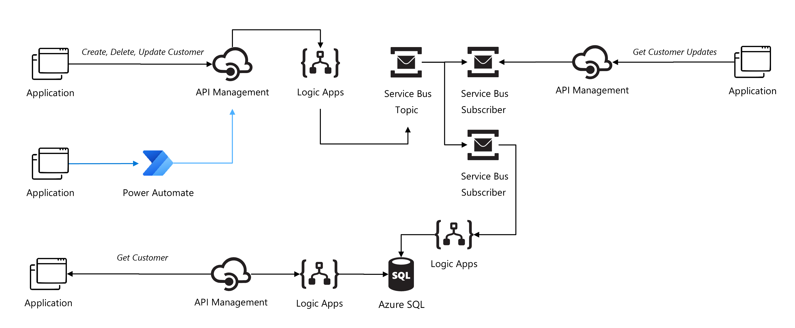

# ais-esb-pattern

## Build Status

| GitHub Action | Status |
| ----------- | ----------- |
| Build | [](https://github.com/pascalvanderheiden/ais-esb-pattern/actions/workflows/build.yml) |
| Release | [](https://github.com/pascalvanderheiden/ais-esb-pattern/actions/workflows/release.yml) |

## About

Deploy a Enterprise Service Bus (ESB) architecture with Azure Integration Services. There is a lot happening in this architecture. I'm using an asynchronous pattern to process Create, Update and Delete operations in a reliable way. The pattern is based on the [Azure Service Bus](https://docs.microsoft.com/en-us/azure/service-bus-messaging/service-bus-messaging-overview) architecture. Instead of performing a read operation to the backend, I've implemented a Operational Data Store to store the latest state of the data, so applications don't have to read from the backend every time they need to process a message. And latency wise this is a lot faster than using the backend. Another important benefit of the architecture, is that providers and consumers are decoupled for this entity. This means that you can easily add new consumers without having to update the backend and you are able to App Modernize the backend over time via a [Strangler pattern](https://docs.microsoft.com/en-us/azure/architecture/patterns/strangler-fig). Every API is fronted with API Management for manageabilty, monitoring, security and scalability. 

For deployment I choose to do it all in Bicep templates & Powershell. I've got most of my examples from [here](https://github.com/Azure/bicep/tree/main/docs/examples).

For creating the Logic Apps workflows I've used [Visual Studio Code to create my Logic Apps (Standard)](https://docs.microsoft.com/en-us/azure/logic-apps/create-single-tenant-workflows-visual-studio-code), so you can develop and test them locally, without even having to go to Azure.  

For deploying the Logic App (Standard) via [Github Actions](https://github.com/Azure/logicapps/tree/master/github-sample).
For deploying the Logic App (Standard) via [Azure DevOps](https://github.com/Azure/logicapps/tree/master/azure-devops-sample).

## Architecture



## Prerequisites

* Install [Visual Studio Code](https://code.visualstudio.com/download)
* Install [Azure Logic Apps (Standard)](https://marketplace.visualstudio.com/items?itemName=ms-azuretools.vscode-azurelogicapps) Extension for Visual Studio Code.
* Install [Azurite](https://marketplace.visualstudio.com/items?itemName=Azurite.azurite) Extension for Visual Studio Code.
* Install [REST Client](https://marketplace.visualstudio.com/items?itemName=humao.rest-client) Extension for Visual Studio Code.
* Install Chocolatey (package manager)

```ps1
Set-ExecutionPolicy Bypass -Scope Process -Force; [System.Net.ServicePointManager]::SecurityProtocol = [System.Net.ServicePointManager]::SecurityProtocol -bor 3072; iex ((New-Object System.Net.WebClient).DownloadString('https://community.chocolatey.org/install.ps1'))
```

* Install Azure Function Core Tools (x64 is needed for debugging)

```ps1
choco install azure-functions-core-tools-3 --params "'/x64'"
```

* Install .NET Core SDK

```ps1
choco install dotnetcore-sdk --params "'/x64'"
```

* Install Bicep CLI

```ps1
choco install bicep
```

* Install Az Module in PowerShell

```ps1
Install-Module -Name Az -AllowClobber -Scope CurrentUser
```

* Install Logic App Azure Cli extensions

```ps1
az extension add --name logic
az extension add --yes --source "https://aka.ms/logicapp-latest-py2.py3-none-any.whl"
```

* Install Application Insights extension

```ps1
az extension add --name application-insights
```

* Install Azure SQL Module in PowerShell

```ps1
Install-Module SQLServer
Import-Module SQLServer
Import-Module Az.Sql -Force
```

## Deploy Manually

* Git Clone the repository

```ps1
git clone https://github.com/pascalvanderheiden/ais-esb-pattern.git
```

* Deploy it all by one script

I've included all the steps in 1 Powershell script. This will create all the needed resources, and will deploy the Logic App and the API in API Management. Keep in mind that this will take a while to deploy.

I've used these variables:

```ps1
$subscriptionId = "<subscription_id>"
$namePrefix = "<project_prefix>"
$administratorLogin = "<administrator_login_sql>"
$administratorLoginPassword = "<administrator_login_password_sql>"
# For removing soft-delete
$apimName = "<apim_name>"
```

Limit the namePrefix to a maximum of 6-7 characters.

```ps1
.\deploy\manual-deploy.ps1 -subscriptionId $subscriptionId -namePrefix $namePrefix -administratorLogin $administratorLogin -administratorLoginPassword $administratorLoginPassword
```

* Remove the APIM Soft-delete

If you deleted the deployment via the Azure Portal, and you want to run this deployment again, you might run into the issue that the APIM name is still reserved because of the soft-delete feature. You can remove the soft-delete by using this script:

```ps1
.\deploy\del-soft-delete-apim.ps1 -subscriptionId $subscriptionId -apimName $apimName
```

* Testing

I've included a tests.http file with relevant tests you can perform, to check if your deployment is successful.

## Deploy with Github Actions

* Fork this repository

* Generate a Service Principal

```ps1
az ad sp create-for-rbac -n <name_sp> --role Contributor --sdk-auth --scopes /subscriptions/<subscription_id>
```

Copy the json output of this command.

* Update GitHub Secrets for customizing your deployment

In the repository go to 'Settings', on the left 'Secrets', 'Actions'.
And pass the json output in the command used above into the secret 'AZURE_CREDENTIALS'.

The following secrets need to be created:

* AZURE_CREDENTIALS
* AZURE_SUBSCRIPTION_ID
* LOCATION
* PREFIX
* ADMINISTRATOR_LOGIN_SQL
* ADMINISTRATOR_LOGIN_PASSWORD_SQL

Limit the PREFIX to a maximum of 6-7 characters.

### Commit

You can trigger the GitHub Actions Build worfklow manually from GitHub. This will automatically kickoff the Release workflow as well. I've experienced some hickups during the Release workflow. The Create SQL Tables sometimes experiences a timeout. Just run it again from GitHub Actions.  

### Note    

If you experience any troubles deploying the Logic Apps to Azure, you can try to deploy them manually via Visual Studio Code. You can find the Logic Apps in the 'ais-esb-' folders. Right-click on the folder, and Deploy to Azure. You can also use the 'Deploy to Azure' button in the Logic App Designer. The build pipeline needs to have run before you can execute this.